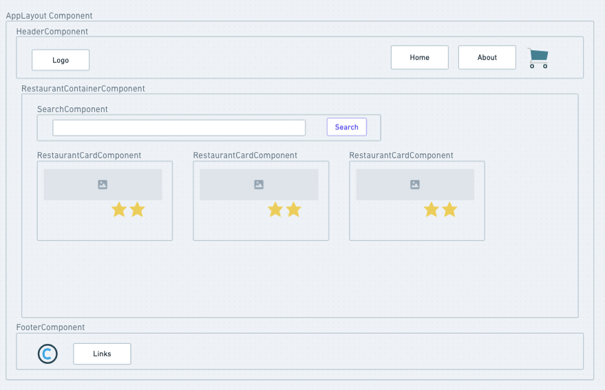
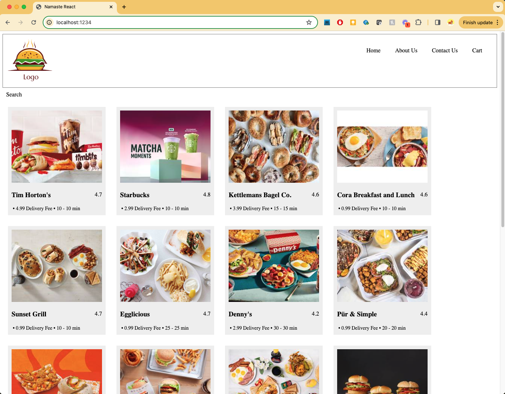

# Namaste React

## App Design Outline
 * Header
    - Logo
    - Nav Items
 * Body
    - Search
    - Restaurant Container
       - Restaurant Card
           - Img
           - Name of Res, Rating, Cusine, delivery time
 * Footer
   - Copyright
   - Links
   - Address
   - Contact
 
 

 
 ## App UI Display at various stages
 ### Episode 04 Part 02
 

 # Redux Toolkit
   - Install @reduxjs/toolkit and react-redux
   - Build the store
   - Connect the store to the app
   - Slice (cartSlice)
   - Dispatch (action)
   - Selector
